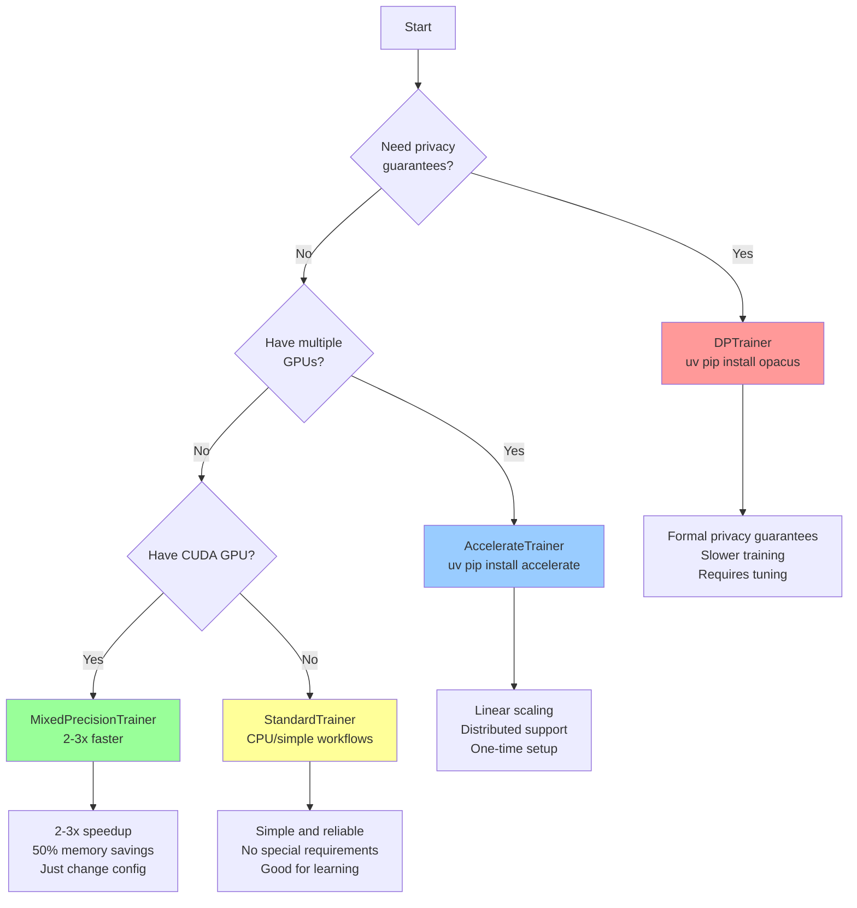

# Advanced Training Guide

Comprehensive guide to specialized trainers for advanced use cases including mixed precision, multi-GPU, and differential privacy training.

---

## Choosing the Right Trainer

Use this decision tree to select the appropriate trainer for your use case:



**Quick selection guide:**
- **StandardTrainer**: Learning the framework, CPU-only, simple workflows
- **MixedPrecisionTrainer**: Single modern GPU, want 2-3x speedup with minimal setup
- **AccelerateTrainer**: Multiple GPUs, distributed training, maximum scalability
- **DPTrainer**: Privacy-sensitive data (medical, financial), need formal guarantees

For most single-GPU users, **MixedPrecisionTrainer** offers the best performance improvement with minimal complexity.

---

## Overview

The framework provides four specialized trainers, each optimized for different scenarios:

- **StandardTrainer**: Traditional PyTorch training
- **MixedPrecisionTrainer**: PyTorch AMP for faster training
- **AccelerateTrainer**: Multi-GPU/distributed with Hugging Face Accelerate
- **DPTrainer**: Differential privacy with Opacus

All trainers inherit from `BaseTrainer` and provide a consistent interface while enabling specialized capabilities.

---

## Mixed Precision Training

Mixed precision training uses 16-bit floating point (FP16 or BF16) for most operations while maintaining 32-bit precision for critical operations. This provides significant performance benefits with minimal accuracy impact.

### Benefits

- **2-3x faster training** on modern GPUs (Volta, Turing, Ampere, Ada)
- **50% memory reduction** - enables larger batch sizes or models
- **Minimal accuracy impact** - automatic loss scaling handles precision
- **Easy to enable** - just change configuration, no code changes needed

### Requirements

- NVIDIA GPU with Tensor Cores (Volta/V100 or newer recommended)
- CUDA 10.0 or higher
- PyTorch 1.6 or higher (built with CUDA support)

### Configuration

```yaml
training:
  trainer_type: 'mixed_precision'
  amp_dtype: 'float16'  # Options: 'float16', 'bfloat16'
  num_epochs: 50
  batch_size: 64  # Can often double batch size due to memory savings

optimizer:
  name: 'adamw'
  lr: 0.001

model:
  architecture: 'resnet50'
  weights: 'DEFAULT'
```

### Float16 vs BFloat16

Choose based on your GPU architecture:

| dtype | GPU Architecture | Pros | Cons |
|-------|------------------|------|------|
| `float16` | Volta, Turing, Ampere (V100, RTX 20/30 series) | Maximum speedup, widest support | May need loss scaling for stability |
| `bfloat16` | Ampere/Ada (A100, RTX 40 series) | Better numerical stability, no loss scaling | Slightly slower than FP16 on older GPUs |

**Recommendation:**
- Use `float16` for RTX 20/30 series, V100
- Use `bfloat16` for A100, H100, RTX 40 series

### Complete Example

```bash
# Install framework
uv pip install -e .

# Train with mixed precision
ml-train --config configs/my_dataset_config.yaml
```

```yaml
# configs/my_dataset_config.yaml
data:
  dataset_name: 'imagenet_subset'
  data_dir: 'data/imagenet_subset'
  fold: 0

model:
  type: 'base'
  architecture: 'efficientnet_b0'
  weights: 'DEFAULT'
  num_classes: 100

training:
  trainer_type: 'mixed_precision'
  amp_dtype: 'float16'
  num_epochs: 100
  batch_size: 128  # Doubled from 64 due to memory savings

optimizer:
  name: 'adamw'
  lr: 0.001
  weight_decay: 0.01

scheduler:
  name: 'cosine'
  warmup_epochs: 5
```

### Performance Expectations

**Hymenoptera dataset (244 images, ResNet18, RTX 3090):**
- Standard training: ~2.5 seconds/epoch
- Mixed precision: ~1.2 seconds/epoch
- **Speedup: 2.1x**

**ImageNet subset (10K images, EfficientNet-B0, A100):**
- Standard training: ~45 seconds/epoch
- Mixed precision: ~18 seconds/epoch
- **Speedup: 2.5x**

**Memory savings:**
- Standard ResNet50 (batch=32): ~8GB VRAM
- Mixed precision (batch=64): ~8GB VRAM
- **2x larger batch size in same memory**

### Troubleshooting

#### Loss becomes NaN or Inf

**Cause:** Numerical overflow/underflow in FP16

**Solutions:**
1. Try `bfloat16` instead of `float16`:
   ```yaml
   training:
     amp_dtype: 'bfloat16'
   ```

2. Reduce learning rate:
   ```yaml
   optimizer:
     lr: 0.0005  # Half of original
   ```

3. Enable gradient clipping:
   ```yaml
   optimizer:
     grad_clip_norm: 1.0
   ```

#### Slower than expected

**Check GPU compatibility:**
```python
import torch
print(f"CUDA version: {torch.version.cuda}")
print(f"GPU: {torch.cuda.get_device_name(0)}")
print(f"Tensor Cores available: {torch.cuda.get_device_capability(0)[0] >= 7}")
```

**Expected:** Major version >= 7 (Volta or newer)

**If older GPU:** Mixed precision may not provide speedup. Use `standard` trainer instead.

#### Accuracy degradation

**Rare but possible solutions:**

1. Use `bfloat16` instead of `float16`
2. Train slightly longer (5-10% more epochs)
3. Try different optimizer (AdamW often more stable than SGD in mixed precision)

---

## Multi-GPU Training with Accelerate

Hugging Face Accelerate provides seamless multi-GPU and distributed training with minimal code changes.

### Benefits

- **Linear scaling** - 2 GPUs = ~2x faster (with proper batch size)
- **Simple setup** - one-time configuration, then use same commands
- **Flexible** - supports single GPU, multi-GPU, multi-node, TPU
- **Gradient accumulation** - train with effectively larger batches
- **Mixed precision** - can combine with AMP for maximum speed

### Requirements

```bash
uv pip install accelerate
```

### One-Time Setup

Run interactive configuration:

```bash
accelerate config
```

**Example configuration:**

```
In which compute environment are you running?
> This machine

Which type of machine are you using?
> multi-GPU

How many different machines will you use?
> 1

Do you want to use DeepSpeed? [yes/NO]:
> NO

Do you want to use FullyShardedDataParallel? [yes/NO]:
> NO

How many GPU(s) should be used for distributed training? [1]:
> 2

Do you wish to use FP16 or BF16 (mixed precision)? [NO/fp16/bf16]:
> fp16
```

**This creates:** `~/.cache/huggingface/accelerate/default_config.yaml`

### Configuration

```yaml
training:
  trainer_type: 'accelerate'
  num_epochs: 50
  batch_size: 32  # Per-device batch size (total = 32 * num_gpus)
  gradient_accumulation_steps: 2  # Optional: effective batch = 32 * 2 * num_gpus

optimizer:
  name: 'adamw'
  lr: 0.001

model:
  architecture: 'resnet50'
  weights: 'DEFAULT'
```

### Launch Commands

#### Single GPU

Same as standard training:

```bash
ml-train --config configs/my_config.yaml
```

#### Multi-GPU (same machine)

```bash
accelerate launch ml-train --config configs/my_config.yaml
```

Accelerate automatically detects the number of GPUs from your config.

#### Multi-GPU with specific config

```bash
accelerate launch --config_file my_accelerate_config.yaml ml-train --config configs/my_config.yaml
```

#### Multi-node distributed

**Node 0 (main):**
```bash
accelerate launch \
  --multi_gpu \
  --num_processes 8 \
  --num_machines 2 \
  --machine_rank 0 \
  --main_process_ip 192.168.1.100 \
  --main_process_port 29500 \
  ml-train --config configs/my_config.yaml
```

**Node 1:**
```bash
accelerate launch \
  --multi_gpu \
  --num_processes 8 \
  --num_machines 2 \
  --machine_rank 1 \
  --main_process_ip 192.168.1.100 \
  --main_process_port 29500 \
  ml-train --config configs/my_config.yaml
```

### Complete Example

```yaml
# configs/imagenet_distributed.yaml
data:
  dataset_name: 'imagenet'
  data_dir: 'data/imagenet'
  fold: 0

model:
  type: 'base'
  architecture: 'resnet50'
  weights: 'DEFAULT'
  num_classes: 1000

training:
  trainer_type: 'accelerate'
  num_epochs: 90
  batch_size: 64  # Per GPU (2 GPUs = 128 total)
  gradient_accumulation_steps: 2  # Effective batch = 256

optimizer:
  name: 'sgd'
  lr: 0.1
  momentum: 0.9
  weight_decay: 0.0001

scheduler:
  name: 'step'
  step_size: 30
  gamma: 0.1

data_loader:
  num_workers: 8
  pin_memory: true
```

```bash
# Train on 2 GPUs
accelerate launch ml-train --config configs/imagenet_distributed.yaml
```

### Gradient Accumulation

Simulate larger batch sizes on limited memory:

```yaml
training:
  batch_size: 32  # Per device
  gradient_accumulation_steps: 4  # Accumulate over 4 steps

# Effective batch size = 32 * 4 * num_gpus
# With 2 GPUs: 32 * 4 * 2 = 256
```

**When to use:**
- Model is too large for desired batch size
- Batch size is limited by GPU memory
- Want larger effective batch without more hardware

**Tradeoff:** Training is slower (more forward passes per update) but can achieve better convergence with larger effective batches.

### Performance Expectations

**ResNet50, ImageNet, 2x A100 (40GB):**
- Single GPU: ~300 images/sec
- Multi-GPU (2x): ~580 images/sec
- **Scaling efficiency: 97%**

**Factors affecting scaling:**
- Network bandwidth between GPUs (PCIe vs NVLink)
- Batch size (too small = communication overhead)
- Model size (larger models = better scaling)
- num_workers (ensure data loading isn't bottleneck)

### Distributed Training Tips

#### 1. Adjust Learning Rate

Linear scaling rule: `new_lr = base_lr * num_gpus`

```yaml
# Single GPU
optimizer:
  lr: 0.001

# 4 GPUs
optimizer:
  lr: 0.004  # 0.001 * 4
```

**Or use warmup:**
```yaml
optimizer:
  lr: 0.004

scheduler:
  name: 'cosine'
  warmup_epochs: 5  # Gradually increase from 0 to 0.004
```

#### 2. Increase num_workers

More GPUs need more data loading throughput:

```yaml
data_loader:
  num_workers: 8  # Per GPU (2 GPUs = 16 total workers)
  pin_memory: true
  prefetch_factor: 2
```

#### 3. Monitor GPU utilization

```bash
# On each node
watch -n 1 nvidia-smi
```

**Target:** >90% GPU utilization on all devices

**If lower:** Increase num_workers or batch_size

#### 4. Use gradient accumulation for large batches

```yaml
training:
  batch_size: 32  # Limited by memory
  gradient_accumulation_steps: 8  # Effective = 256 per GPU
```

#### 5. Save bandwidth with gradient checkpointing

For very large models, reduce memory at cost of computation:

```python
# In model definition
model.gradient_checkpointing_enable()
```

---

## Differential Privacy Training

Differential privacy (DP) provides mathematical guarantees that training doesn't leak information about individual data points. Critical for sensitive data (medical, financial, personal).

### Privacy Concepts

#### Epsilon (ε)

Privacy budget - how much information can "leak"

- **ε < 1**: Strong privacy (recommended for sensitive data)
- **ε = 1-3**: Moderate privacy (research/development)
- **ε > 10**: Weak privacy (may not provide meaningful protection)

**Lower ε = stronger privacy but lower accuracy**

#### Delta (δ)

Probability of privacy violation

**Typical value:** `1/n_samples` or `1e-5`

**Example:**
- Dataset: 10,000 samples
- Delta: `1e-5` (0.001% chance of privacy violation)

#### Noise Multiplier

Controls the amount of noise added to gradients

- **Higher = more privacy** (larger ε reduction per step)
- **Lower = better accuracy** (less noise)

**Typical range:** 0.5 - 2.0

### Requirements

```bash
uv pip install opacus
```

**Note:** Opacus requires:
- PyTorch 1.8 or higher
- Compatible model architecture (some layers not supported)

### Configuration

```yaml
training:
  trainer_type: 'dp'
  num_epochs: 50
  batch_size: 32  # DP requires fixed batch sizes

  dp:
    noise_multiplier: 1.1      # Privacy-accuracy tradeoff
    max_grad_norm: 1.0         # Gradient clipping threshold
    target_epsilon: 3.0        # Target privacy budget
    target_delta: 1e-5         # Privacy parameter

optimizer:
  name: 'sgd'  # SGD or Adam (AdamW may not be supported)
  lr: 0.01     # Often needs higher LR than non-DP

model:
  architecture: 'resnet18'  # Ensure DP-compatible
  weights: null  # Pretrained weights complicate privacy analysis
```

### Complete Example

```yaml
# configs/medical_imaging_private.yaml
data:
  dataset_name: 'chest_xray'
  data_dir: 'data/chest_xray'
  fold: 0

model:
  type: 'base'
  architecture: 'resnet18'
  weights: null  # Train from scratch for DP guarantees
  num_classes: 3

training:
  trainer_type: 'dp'
  num_epochs: 100  # May need more epochs than non-DP
  batch_size: 32   # Must be fixed (no drop_last variations)

  dp:
    noise_multiplier: 1.1      # Good privacy-utility tradeoff
    max_grad_norm: 1.0         # Standard clipping
    target_epsilon: 3.0        # Moderate privacy
    target_delta: 1e-5         # Standard for this dataset size

optimizer:
  name: 'sgd'
  lr: 0.05      # Higher than typical 0.01
  momentum: 0.9
  weight_decay: 0.0001

scheduler:
  name: 'cosine'
  warmup_epochs: 10

data_loader:
  num_workers: 4
  pin_memory: true
```

```bash
# Train with DP
ml-train --config configs/medical_imaging_private.yaml
```

### Interpreting Privacy Budget

**Privacy spent during training is logged:**

```
Epoch 10/100: ε=1.2, δ=1e-5
Epoch 50/100: ε=2.7, δ=1e-5
Epoch 100/100: ε=3.8, δ=1e-5  # Exceeded target slightly
```

**What this means:**

- **ε=1.2**: Strong privacy - very difficult to infer individual data points
- **ε=2.7**: Moderate privacy - good for most research applications
- **ε=3.8**: Target was 3.0, but 3.8 is still acceptable for non-critical applications

**Publishing results:**

Always report both ε and δ:
- "Model trained with (ε=3.0, δ=1e-5)-differential privacy"

### Performance Considerations

#### Training Speed

**DP is slower than standard training:**
- Per-sample gradient computation (instead of batch)
- Gradient clipping and noise addition
- Privacy accounting overhead

**Expected:** 2-3x slower than standard training

**Hymenoptera dataset (244 images, ResNet18):**
- Standard: ~2.5 sec/epoch
- DP: ~6.5 sec/epoch

#### Memory Usage

**DP requires more memory:**
- Per-sample gradients stored temporarily
- Typically +20-40% memory usage

**If OOM:** Reduce batch size or use smaller model

#### Accuracy Impact

**Privacy-utility tradeoff:**

| Target ε | Expected Accuracy Drop | Use Case |
|----------|------------------------|----------|
| ε < 1 | 5-15% | Strong privacy required |
| ε = 1-3 | 2-8% | Moderate privacy |
| ε = 3-8 | 1-5% | Research/development |
| ε > 10 | <2% | Weak privacy (questionable utility) |

### Hyperparameter Tuning for DP

DP training requires different hyperparameters than standard training:

#### 1. Learning Rate

**Usually needs higher LR:**

```yaml
optimizer:
  lr: 0.05  # vs 0.01 for standard training
```

**Why?** Noise dampens gradient signal, need stronger updates.

#### 2. Batch Size

**Larger is better for privacy-utility:**

```yaml
training:
  batch_size: 64  # vs 32 for standard
```

**Why?** Larger batches = better gradient estimates despite noise.

**Tradeoff:** More memory usage, may need to reduce model size.

#### 3. Training Duration

**May need more epochs:**

```yaml
training:
  num_epochs: 150  # vs 100 for standard
```

**Why?** Noisy gradients slow convergence.

#### 4. Noise Multiplier

**Start with 1.1, adjust based on results:**

```yaml
dp:
  noise_multiplier: 1.1  # Default
  # If accuracy too low: try 0.9
  # If need stronger privacy: try 1.3
```

#### 5. Gradient Clipping

**Critical for DP:**

```yaml
dp:
  max_grad_norm: 1.0  # Standard
  # If gradients exploding: try 0.5
  # If underfitting: try 1.5
```

### Troubleshooting

#### Module not compatible with DP

**Error:**
```
ModuleNotFoundError: Module X is not compatible with DP
```

**Cause:** Some layers (BatchNorm, GroupNorm) are not DP-compatible by default.

**Solution:** Use Opacus-compatible replacements:

```python
from opacus.layers import DPLSTM, DPMultiheadAttention

# Or use LayerNorm instead of BatchNorm
# Or use GroupNorm with num_groups=1 (InstanceNorm)
```

#### Privacy budget exceeded early

**Symptoms:** Target ε reached at epoch 30/100

**Solutions:**

1. **Increase noise_multiplier:**
   ```yaml
   dp:
     noise_multiplier: 1.5  # More noise = slower privacy budget growth
   ```

2. **Increase target_epsilon:**
   ```yaml
   dp:
     target_epsilon: 5.0  # Accept slightly weaker privacy
   ```

3. **Reduce training epochs:**
   ```yaml
   training:
     num_epochs: 50  # Finish before budget exhausted
   ```

#### Poor accuracy with DP

**Solutions:**

1. **Tune learning rate (try 2-5x higher):**
   ```yaml
   optimizer:
     lr: 0.1
   ```

2. **Increase batch size:**
   ```yaml
   training:
     batch_size: 128
   ```

3. **Use learning rate warmup:**
   ```yaml
   scheduler:
     name: 'cosine'
     warmup_epochs: 15
   ```

4. **Reduce noise_multiplier (weaker privacy):**
   ```yaml
   dp:
     noise_multiplier: 0.8
   ```

5. **Train longer:**
   ```yaml
   training:
     num_epochs: 200
   ```

---

## Combining Techniques

Some trainers can be combined for maximum efficiency.

### Mixed Precision + Accelerate

**Best for:** Multi-GPU training with maximum speed

```yaml
training:
  trainer_type: 'accelerate'  # Handles multi-GPU
  num_epochs: 90
  batch_size: 64  # Per GPU

# In accelerate config:
# mixed_precision: 'fp16'
```

```bash
accelerate config  # Choose fp16 when prompted
accelerate launch ml-train --config configs/my_config.yaml
```

**Performance:**
- 2x A100 with FP16: ~4-5x faster than single GPU FP32

### Accelerate + Gradient Accumulation

**Best for:** Limited memory but need large effective batches

```yaml
training:
  trainer_type: 'accelerate'
  batch_size: 16  # Small due to memory
  gradient_accumulation_steps: 8  # Effective = 128 per GPU
```

**With 4 GPUs:** Effective batch = 16 × 8 × 4 = 512

---

## Choosing the Right Trainer

### Decision Matrix

| Scenario | Recommended Trainer | Config |
|----------|---------------------|--------|
| Learning framework, single GPU | `standard` | Default config |
| Single modern GPU, want speed | `mixed_precision` | `amp_dtype: 'float16'` |
| Multiple GPUs available | `accelerate` | + mixed precision in accelerate config |
| Privacy-sensitive data | `dp` | Set `target_epsilon` appropriately |
| Large model, limited memory | `accelerate` | + gradient accumulation |
| Research on DP | `dp` | Tune hyperparameters carefully |

### Performance Comparison

**ImageNet, ResNet50, various setups:**

| Setup | Hardware | Time/Epoch | Speedup |
|-------|----------|------------|---------|
| Standard | 1x V100 | 180 sec | 1.0x |
| Mixed Precision | 1x V100 | 75 sec | 2.4x |
| Accelerate | 4x V100 | 50 sec | 3.6x |
| Accelerate + FP16 | 4x V100 | 22 sec | 8.2x |
| DP | 1x V100 | 420 sec | 0.43x |

---

## Inference Strategies

The framework provides specialized inference strategies that mirror the training architecture, enabling performance optimizations for model evaluation and deployment.

### Overview

Three inference strategies are available:

- **StandardInference**: Traditional PyTorch inference (default, works on CPU/GPU)
- **MixedPrecisionInference**: AMP inference for 2-3x speedup on GPU
- **AccelerateInference**: Multi-GPU/distributed inference for large test sets

All strategies inherit from `BaseInferenceStrategy` and provide consistent interfaces while enabling specialized capabilities.

---

### Standard Inference

Traditional PyTorch inference with manual device management. This is the default strategy and works on both CPU and GPU.

**When to use:**
- CPU-only environments
- Simple workflows
- Backward compatibility
- Baseline performance measurements

**Configuration:**

```yaml
inference:
  strategy: 'standard'  # Default, can be omitted
```

**Performance:**
- Baseline: 1.0x speed
- Memory: Standard PyTorch memory usage
- Compatible: All devices (CPU, GPU, MPS)

---

### Mixed Precision Inference

Uses PyTorch AMP for faster inference with reduced memory usage. Ideal for production deployments where speed is critical.

**Benefits:**
- **2-3x faster inference** on modern GPUs (Volta, Turing, Ampere, Ada)
- **50% memory reduction** - enables larger batch sizes during evaluation
- **Automatic CPU fallback** - gracefully degrades to standard inference on CPU
- **Numerical stability** - minimal accuracy impact compared to FP32

**Requirements:**
- NVIDIA GPU with Tensor Cores (Volta/V100 or newer recommended)
- CUDA 10.0 or higher
- PyTorch 1.6 or higher (built with CUDA support)

**Configuration:**

```yaml
inference:
  strategy: 'mixed_precision'
  amp_dtype: 'float16'  # Options: 'float16' (faster) or 'bfloat16' (more stable)
```

**Float16 vs BFloat16:**

| dtype | GPU Architecture | Pros | Cons |
|-------|------------------|------|------|
| `float16` | Volta, Turing, Ampere (V100, RTX 20/30 series) | Maximum speedup, widest support | May have numerical precision differences |
| `bfloat16` | Ampere/Ada (A100, RTX 40 series) | Better numerical stability | Slightly slower than FP16 on older GPUs |

**Recommendation:**
- Use `float16` for RTX 20/30 series, V100
- Use `bfloat16` for A100, H100, RTX 40 series

**Usage Example:**

```yaml
# config.yaml
data:
  dataset_name: 'my_dataset'
  data_dir: 'data/my_dataset'

model:
  type: 'base'
  architecture: 'efficientnet_b0'
  num_classes: 100

inference:
  strategy: 'mixed_precision'
  amp_dtype: 'float16'
```

```bash
# Run inference with mixed precision
ml-inference --checkpoint_path runs/my_run/weights/best.pt
```

**Performance Expectations:**

**Hymenoptera dataset (153 test images, ResNet18, RTX 3090):**
- Standard inference: ~0.8 seconds
- Mixed precision: ~0.3 seconds
- **Speedup: 2.7x**

**ImageNet validation (50K images, EfficientNet-B0, A100):**
- Standard inference: ~180 seconds
- Mixed precision: ~65 seconds
- **Speedup: 2.8x**

---

### Accelerate Inference

Uses HuggingFace Accelerate for distributed inference across multiple GPUs. Ideal for large test sets where evaluation time matters.

**Benefits:**
- **Near-linear scaling** with GPU count
- **Automatic result aggregation** across processes
- **Simple setup** - same commands as training
- **Works in single-device mode** - no distributed launch required for testing

**Requirements:**

```bash
uv pip install accelerate
```

**Configuration:**

```yaml
inference:
  strategy: 'accelerate'
```

**Usage:**

#### Single Device

```bash
# Standard inference CLI call
ml-inference --checkpoint_path runs/my_run/weights/best.pt
```

#### Multi-GPU (same machine)

```bash
# First, ensure accelerate is configured
accelerate config

# Then launch with accelerate
accelerate launch ml-inference --checkpoint_path runs/my_run/weights/best.pt
```

**Complete Example:**

```yaml
# config.yaml
data:
  dataset_name: 'imagenet'
  data_dir: 'data/imagenet'

model:
  type: 'base'
  architecture: 'resnet50'
  num_classes: 1000

inference:
  strategy: 'accelerate'

data_loader:
  num_workers: 8  # Per GPU
  pin_memory: true
```

```bash
# Evaluate on 4 GPUs
accelerate launch ml-inference --checkpoint_path runs/imagenet_run/weights/best.pt
```

**Performance Expectations:**

**ImageNet validation (50K images, ResNet50, 4x A100):**
- Single GPU: ~180 seconds
- Multi-GPU (4x): ~50 seconds
- **Scaling efficiency: 90%**

**Factors affecting scaling:**
- Network bandwidth (PCIe vs NVLink)
- Batch size (larger = better scaling)
- num_workers (ensure data loading isn't bottleneck)
- Test set size (larger = better scaling)

---

### Comparison Table

| Strategy | Speed | Memory | Use Case | Requirements |
|----------|-------|--------|----------|--------------|
| `standard` | 1x | 100% | CPU, simple workflows, baseline | PyTorch only |
| `mixed_precision` | 2-3x | 50% | GPU inference, speed critical | CUDA GPU |
| `accelerate` | Nx | 100% | Large test sets, multiple GPUs | accelerate package |

**Quick selection guide:**
- **StandardInference**: Default choice, works everywhere
- **MixedPrecisionInference**: Single GPU, want 2-3x speedup
- **AccelerateInference**: Multiple GPUs, large test sets

---

### Choosing the Right Strategy

#### Decision Tree

```
Need fastest inference?
├─ Yes, multiple GPUs available
│  └─ Use: accelerate
└─ Yes, single GPU
   └─ Use: mixed_precision

Need CPU support?
└─ Use: standard (or mixed_precision with CPU fallback)

Testing framework/debugging?
└─ Use: standard

Production deployment (GPU)?
└─ Use: mixed_precision
```

#### Common Scenarios

**Scenario 1: Development/Testing**
```yaml
inference:
  strategy: 'standard'  # Simple and reliable
```

**Scenario 2: Production Deployment (Single GPU Server)**
```yaml
inference:
  strategy: 'mixed_precision'
  amp_dtype: 'float16'  # 2-3x faster, minimal setup
```

**Scenario 3: Batch Processing (Multi-GPU Server)**
```yaml
inference:
  strategy: 'accelerate'  # Near-linear scaling
```

**Scenario 4: CPU-only Environment**
```yaml
inference:
  strategy: 'standard'  # Only option for CPU
# Or use mixed_precision with automatic CPU fallback
```

---

### Advanced Usage

#### Combining with Training Strategies

Inference strategies work independently of training strategies. You can train with one strategy and infer with another:

```yaml
# Training config
training:
  trainer_type: 'accelerate'  # Multi-GPU training

# Inference config (automatically loaded from checkpoint)
inference:
  strategy: 'mixed_precision'  # Fast single-GPU inference
```

#### Integration with CLI

All inference strategies work seamlessly with the `ml-inference` CLI:

```bash
# Standard inference
ml-inference --checkpoint_path runs/my_run/weights/best.pt

# Config is loaded from runs/my_run/config.yaml
# Inference strategy is read from config['inference']['strategy']
```

#### Programmatic Usage

You can also use strategies programmatically:

```python
from ml_src.core.inference import get_inference_strategy

# Load config
config = {
    'inference': {
        'strategy': 'mixed_precision',
        'amp_dtype': 'float16'
    }
}

# Get strategy
strategy = get_inference_strategy(config)

# Run inference
test_acc, results = strategy.run_inference(
    model=model,
    dataloader=test_loader,
    dataset_size=len(test_dataset),
    device=device,
    class_names=['cat', 'dog']
)

print(f"Test Accuracy: {test_acc:.4f}")
```

---

### Troubleshooting

#### Mixed Precision: Results differ from standard

**Expected behavior:** Results may differ slightly due to reduced numerical precision.

**Typical difference:** <0.1% accuracy difference

**If larger differences:**
1. Try `bfloat16` instead of `float16`:
   ```yaml
   inference:
     amp_dtype: 'bfloat16'
   ```

2. Verify model is in eval mode (handled automatically)

3. Check for custom layers that may not support AMP

#### Accelerate: Slower than expected

**Check GPU utilization:**
```bash
watch -n 1 nvidia-smi
```

**If <80% utilization:**
1. Increase batch size (if memory allows)
2. Increase num_workers
3. Check test set size (too small = communication overhead)

**Verify proper launch:**
```bash
# Wrong: single-device mode
python ml-inference --checkpoint_path ...

# Correct: multi-device mode
accelerate launch ml-inference --checkpoint_path ...
```

#### Strategy not found error

**Error:**
```
ValueError: Unknown inference strategy: 'mixed_precision'
```

**Cause:** Old config or typo in strategy name

**Solution:** Check spelling and ensure config has correct strategy:
```yaml
inference:
  strategy: 'standard'  # or 'mixed_precision' or 'accelerate'
```

---

## Best Practices

### Before Training

1. **Test with standard trainer first** - verify dataset and config work
2. **Start simple, optimize later** - don't use advanced features until needed
3. **Check hardware compatibility** - GPU compute capability for mixed precision
4. **Monitor resources** - GPU memory, utilization, disk I/O

### During Training

1. **Monitor metrics closely** - DP especially can show unexpected behavior
2. **Use TensorBoard** - compare runs across different trainer types
3. **Check scaling efficiency** - multi-GPU should scale near-linearly
4. **Save checkpoints frequently** - especially for long distributed runs

### After Training

1. **Document setup** - record trainer type, GPUs used, any issues
2. **Report privacy budgets** - if using DP, always report (ε, δ)
3. **Compare to baselines** - validate advanced trainers improve on standard
4. **Consider deployment** - models trained with DP can be deployed anywhere

---

## Further Reading

### Documentation

- [Training Guide](training.md) - Basic training workflows
- [Configuration Reference](../configuration/training.md) - All training parameters
- [Hyperparameter Tuning](hyperparameter-tuning.md) - Systematic optimization

### External Resources

#### Mixed Precision
- [PyTorch AMP Tutorial](https://pytorch.org/docs/stable/amp.html)
- [NVIDIA Mixed Precision Training Guide](https://docs.nvidia.com/deeplearning/performance/mixed-precision-training/)

#### Accelerate
- [Hugging Face Accelerate Docs](https://huggingface.co/docs/accelerate/)
- [Distributed Training Best Practices](https://huggingface.co/docs/transformers/perf_train_gpu_many)

#### Differential Privacy
- [Opacus Documentation](https://opacus.ai/)
- [Differential Privacy Explained](https://programming-dp.com/)
- [DP-SGD Paper](https://arxiv.org/abs/1607.00133) (Abadi et al., 2016)

---

## Summary

You've learned:

- **Mixed Precision**: 2-3x speedup with minimal setup
- **Multi-GPU**: Linear scaling with Accelerate
- **Differential Privacy**: Formal privacy guarantees for sensitive data
- **Combining Techniques**: Maximum performance with multiple strategies
- **Troubleshooting**: Common issues and solutions for each trainer

**Next steps:**
1. Choose appropriate trainer for your use case
2. Start with recommended configuration
3. Monitor training carefully
4. Tune hyperparameters if needed

**Questions?** See [Troubleshooting](../reference/troubleshooting.md) or [FAQ](../reference/faq.md).
